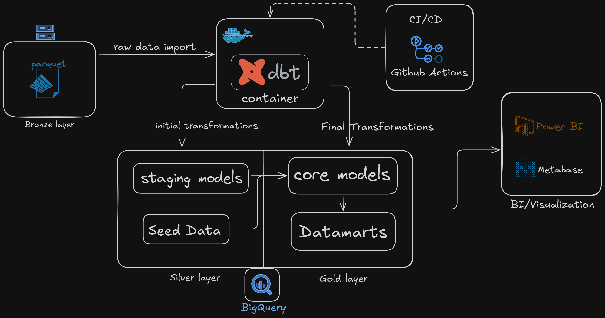

# NYC Taxi Rides Analytics Pipeline

A comprehensive DBT project for transforming and analyzing NYC taxi rides data using BigQuery, Docker, and modern data engineering practices.

## Table of Contents
- [Overview](#overview)
- [Features](#features)
- [Prerequisites](#prerequisites)
- [Project Setup](#project-setup)
- [Development Workflow](#development-workflow)
- [Project Structure](#project-structure)
- [Data Models](#data-models)
- [Testing](#testing)
- [Documentation](#documentation)
- [Production Deployment](#production-deployment)
- [Troubleshooting](#troubleshooting)
- [Author](#author)
- [License](#license)

## Overview

This project implements an analytics pipeline that processes NYC taxi rides data. It transforms raw taxi data into analytical models for business insights using DBT (Data Build Tool) and BigQuery.



## Features
- 🔄 Modular data transformation pipeline
- 🐳 Containerized development and production environments
- 🧪 Automated testing suite
- 📊 Comprehensive data models for taxi ride analytics
- 📚 Auto-generated documentation
- 🔄 CI/CD integration with GitHub Actions

## Prerequisites
- Docker and Docker Compose
- GCP Account with BigQuery access
- Git
- GCP credentials file configured at:
  - Windows: `E:/.config/gcloud/application_default_credentials.json`
  - Linux/Mac: `~/.config/gcloud/application_default_credentials.json`

## Project Setup

### 1. Clone Repository
```bash
git clone <repository-url>
cd taxi_rides_ny
```

### 2. Start Development Environment
```bash
# Build and start development container
docker compose up dbt-dev

# Access the container
docker compose exec dbt-dev bash
```

### 3. Initialize Project
```bash
# Inside container
dbt deps
dbt seed
dbt compile
dbt test
dbt run
```

## Development Workflow

### Daily Development Cycle
```bash
# 1. Start development container
docker compose up dbt-dev -d

# 2. Access container
docker compose exec dbt-dev bash

# 3. Run unified command
dbt deps && dbt seed && dbt compile && dbt test && dbt run
```

### Documentation Generation
```bash
# Generate and serve docs
dbt docs generate && dbt docs serve --port 8080
```

## Project Structure
```
taxi_rides_ny/
├── models/
│   ├── core/              # Core business logic models
│   └── staging/           # Initial data transformation
├── macros/               # Reusable SQL functions
├── tests/                # Custom test definitions
├── seeds/                # Static reference data
├── analyses/             # Ad-hoc analyses
├── docs/                 # Project documentation
└── docker-compose.yaml   # Container configuration
```

## Data Models

### Staging Models
- `stg_green_tripdata`: Green taxi trip data transformation
- `stg_yellow_tripdata`: Yellow taxi trip data transformation

### Core Models
- `fact_trips`: Main fact table combining green and yellow taxi data
- `dim_zones`: Dimensional table for taxi zones
- `dm_monthly_zone_revenue`: Monthly revenue aggregations by zone

## Testing
```bash
# Run all tests
dbt test

# Test specific models
dbt test --select model_name
```

## Documentation
Access documentation at http://localhost:8080 after running:
```bash
dbt docs generate && dbt docs serve --port 8080
```

## Production Deployment

### Start Production Environment
```bash
# Build and start production container
docker compose up dbt-prod
```

### Production Features
- Uses `trips_data_all_prod` dataset
- 12 concurrent threads
- Documentation on port 8081
- Automated model runs and testing

## Troubleshooting

### Common Issues

#### Container Access
```bash
# Check container status
docker compose ps

# View logs
docker compose logs dbt-dev
```

#### Clean Environment
```bash
# Remove containers and volumes
docker compose down -v

# Clean DBT artifacts
rm -rf target/ dbt_packages/ logs/
```

## Author
**Abhay Ahirkar**
- GitHub: [@abhayra12](https://github.com/abhayra12)

## License
This project is licensed under the MIT License. See the LICENSE file for details.
